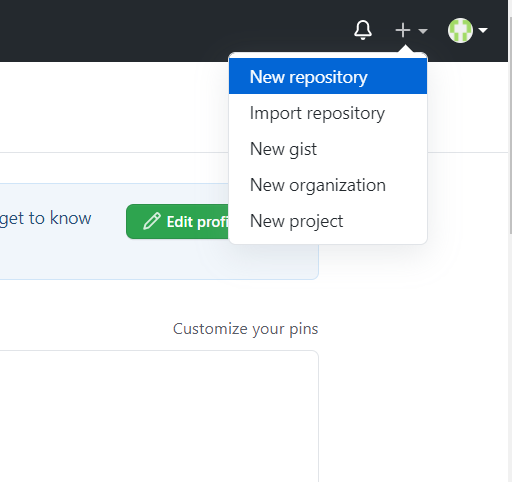
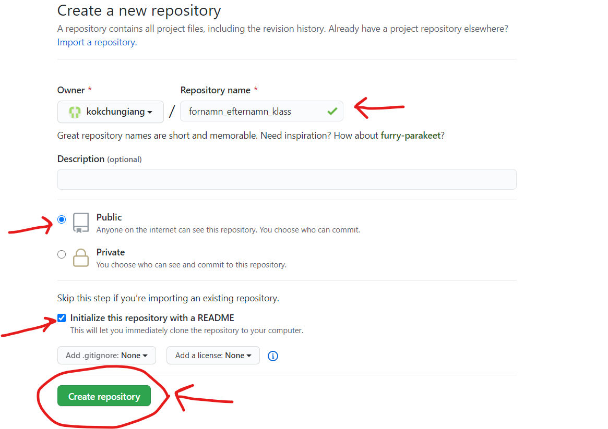
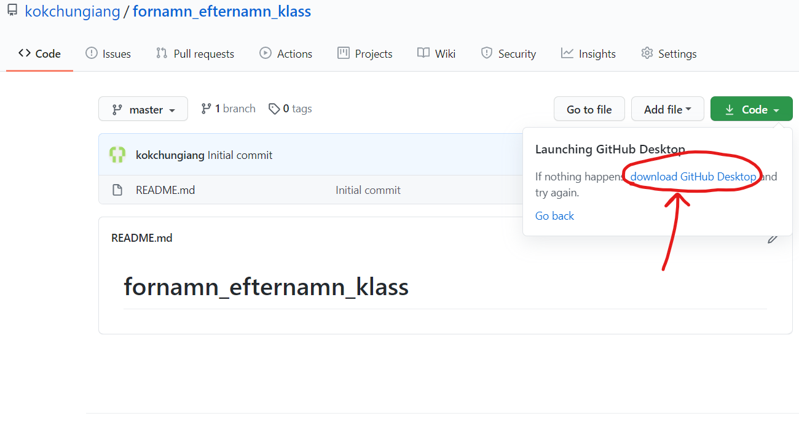
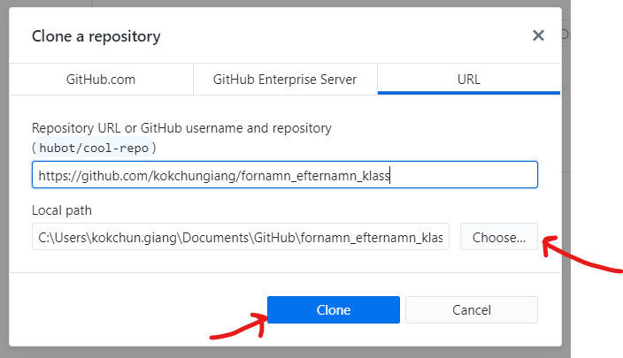
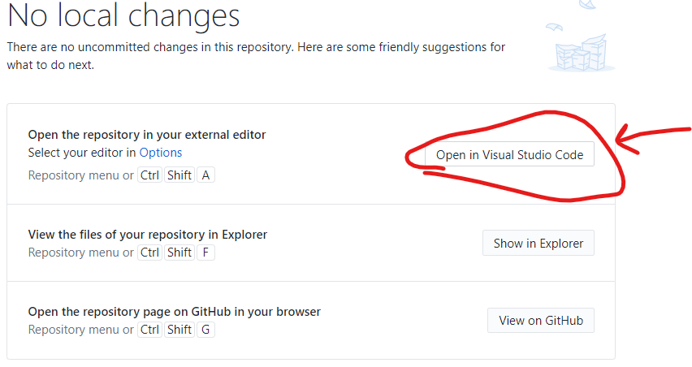

```markdown
Du ska nu installera olika verktyg vi kommer använda i kursen, 
skapa ett konto på github samt ett första repo.  
Följ stegen nedan i rätt ordning och var uppmärksam på detaljer!
```
## Har du redan laddat ner och installerat Visual Studio Code kan du hoppa över detta steg
1. Ladda hem och installera Visual Studio Code <a href="https://code.visualstudio.com/docs/?dv=win64user" target="_blank">här</a>. 
2. Fullfölj installationen med standardinställningar.

## Ladda hem och installer Git till Windows
1. Ladda hem och installera Git till Windows <a href="https://github.com/git-for-windows/git/releases/download/v2.18.0.windows.1/Git-2.18.0-64-bit.exe" target="_blank">här</a>.
2. Installera git genom att köra exe-filen och **klicka bara på nästa**. <br>
    Du behöver INTE ändra förvalda inställningar.

## Skapa konto på GitHub och ditt första repo
1. Skapa ett konto på GitHub och använd din skolmail: förnamn.efternamn@elev.ga.ntig.se <a href="https://github.com/join" target="_blank">här</a>.
2. Skapa ditt första repo 



3. Ladda ned/alternativt öppna Github desktop


4. Starta exe-filen så kör installationen sig självt.

5. När installationen är klar, logga in med ditt GitHub-konto på GitHub Desktop.

6. Gå in på Github, välj ditt repo och klicka på clone. Välj lämplig plats.


7. Klicka på open in visual studio code

 